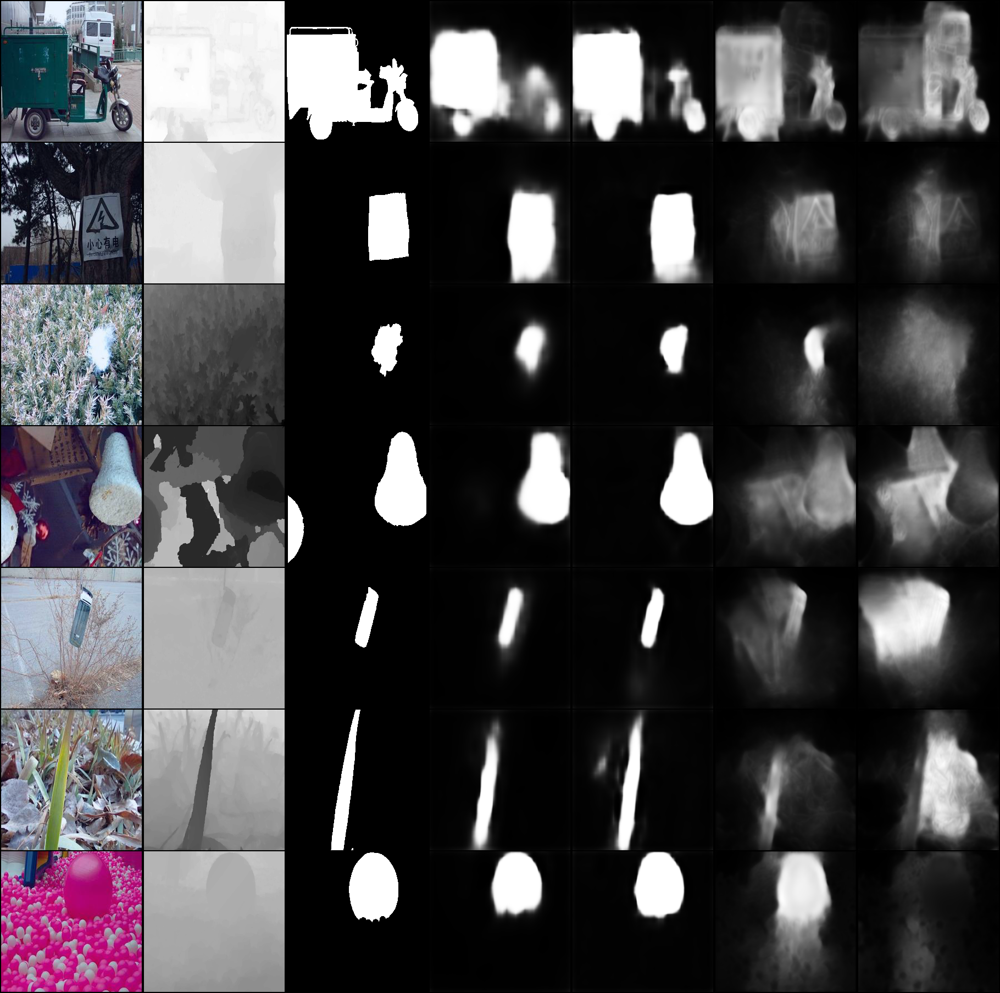

# Approach to improve RGB-based Salient Object Detection using Depth Information and Knowledge Distillation
2021년 한국지능정보시스템학회 추계 학술대회 우수 논문상 ([website](http://www.kiiss.or.kr/conference/conf/sub05.html))

## Author
* [JinHong Min](https://github.com/alswlsghd320)
* [Eunbi Park](https://github.com/bluvory)
* Hongju Lee



Paper: *<upload later>*<br>

Abstract: *<Unlike conventional object detection, Salient Object Detection aims to find the most important object in the image. That is, by separating an object in which human gaze is concentrated from the background, it is used in various fields such as background removal, object tracking and detection, and recognition. The detection of protruding objects is mainly performed in RGB data to selectively grasp global and regional situation information. However, in the case of less contrast, detection may fail, so it plays an important role in finding prominent objects by using additional depth information to compensate for this. However, as opposed to improved performance, additional depth information increases the complexity of the model and lowers the inference speed. Therefore, there is a need to use depth information, but solve the above problems. This study proposes a method to improve the accuracy in detecting protruding objects using Knowledge Distillation. We first learn the RGBD model and then use it as a teacher network. After that, the RGB model is placed as a student neural network and knowledge distillation is applied to increase the performance of the existing RGB model. In addition, the hyperparameters used in knowledge distillation are not set to fixed values, but stable performance improvement is achieved through the method proposed in this paper. Through this, it is possible to overcome problems in practical aspects such as limitations of memory and increase in inference time as well as improvement of detection performance. In this experiment, RGB-based protruding object detection models such as BASNet, U2net, and PoolNet were evaluated through a total of four evaluation indicators: MAE, F-measure, E-measure, and S-measure, showing meaningful performance improvement of models using knowledge distillation over conventional RGB models.*><br>

## Requirements
```.bash
#For Anaconda
conda env create -f environment_cuda11_1.yml # For CUDA 11.1
```

## Training
We train our models with
  [NJU2K](https://paperswithcode.com/dataset/nju2k),
  [SIP](https://paperswithcode.com/dataset/sip),
  [DUT-RGBD/train]()

```.bash
'''
KIISS2021/
  ㄴdatasets/
        ㄴDUT-RGBD/
        ㄴLFSD/
        ㄴNJU2K/
        ㄴSIP/
        ...
  ㄴmodels/
  ...
'''
# For Train Teacher Network
python train_rgbd.py --args

# For Train Student Network Only
python train_rgb.py --args

# For Train Student Network with Knowledge Distillation
python train_kd.py --args
```

The results are placed in `run/<RUNNING_TIME>/<tensorboard>`. 

## Test

We train our models with
  [SSD](),
  [LFSD](https://paperswithcode.com/dataset/lfsd),
  [STEREO-1000](),
  [DUT-RGBD/test]()

```.bash
# For test
python test.py --path <model_path> --model <PoolNet or BASNet or u2net> --dataset <test_dataset> ...
```

## Results
| BASNet | U2Net | PoolNet |
| w/o KD | w/ KD | $\delta$ | w/o KD | w/ KD | $\delta$ | w/o KD | w/ KD | $\delta$ |
| ------ | ------ | ------ | ------ | ------ | ------ | ------ | ------ | ------ |
| DUT-RGBD | $F_{\beta}$ | 0.8144 | 0.8232 | 0.0088	0.8085	0.8401	0.0316	0.6855	0.6922	0.0067
| $F_{\beta}$ | 0.7297	0.7408	0.0111	0.7152	0.7598	0.0446	0.5371	0.5472	0.0103
| $E$ | 0.6970 | 0.7036 |	0.0066	0.6738	0.7062	0.0324	0.5110	0.5159	0.0049
| $MAE$ | 0.1856	0.1768	0.0088	0.1915	0.1599	0.0316	0.3110	0.3078	0.0032
SSD		0.7953	0.8100	0.0147	0.8036	0.8166	0.013	0.6287	0.6368	0.0081
 		0.6779	0.6963	0.0184	0.6841	0.7059	0.0218	0.4802	0.4923	0.0121
 		0.6494	0.6655	0.0161	0.6479	0.6526	0.0047	0.4478	0.4511	0.0033
 	MAE 	0.2047	0.1900	0.0147	0.1964	0.1834	0.013	0.3730	0.3632	0.0098
LFSD		0.7851	0.7901	0.0050	0.7672	0.8084	0.0412	0.7276	0.7319	0.0043
 		0.7073	0.7135	0.0062	0.6797	0.7297	0.0500	0.6275	0.6334	0.0059
 		0.6719	0.6745	0.0026	0.6440	0.6733	0.0293	0.5783	0.5808	0.0025
 	MAE 	0.2149	0.2099	0.0050	0.2328	0.1952	0.0376	0.2718	0.2681	0.0037
STEREO		0.8469	0.8503	0.0034	0.8360	0.8661	0.0301	0.7063	0.7092	0.0029
 		0.7587	0.7659	0.0072	0.7385	0.7878	0.0493	0.5601	0.5684	0.0083
 		0.7234	0.7282	0.0048	0.6985	0.7305	0.0320	0.5360	0.5390	0.0030
 	MAE 	0.1531	0.1497	0.0034	0.1640	0.1339	0.0301	0.2949	0.2908	0.0041

  
DUT-RGBD		0.8127	0.7848	0.8095	0.7949	0.7865	0.8087	0.8401
 		0.7200	0.6864	0.7156	0.6971	0.6872	0.7253	0.7598
 		0.6725	0.6408	0.6693	0.6499	0.6417	0.6770	0.7062
 	MAE 	0.1873	0.2152	0.1905	0.2051	0.2135	0.1713	0.1599
LFSD		0.7912	0.7816	0.7838	0.7597	0.7771	0.7862	0.8166
 		0.7110	0.6927	0.7038	0.6781	0.6900	0.6834	0.7059
 		0.6590	0.6463	0.6524	0.6298	0.6427	0.6437	0.6526
 	MAE 	0.2088	0.2184	0.2162	0.2403	0.2229	0.2138	0.1834
SSD		0.7868	0.7655	0.7954	0.8006	0.7696	0.7860	0.8084
 		0.6713	0.6501	0.6900	0.7008	0.6667	0.6695	0.7297
 		0.6241	0.6044	0.6353	0.6389	0.6062	0.6314	0.6733
 	MAE 	0.2132	0.2345	0.2046	0.1994	0.2304	0.2140	0.1952
STEREO		0.8476	0.8269	0.8513	0.8499	0.8389	0.8485	0.8661
 		0.7592	0.7268	0.7671	0.7654	0.7483	0.7693	0.7878
 		0.7082	0.6794	0.7118	0.7113	0.6943	0.7139	0.7305
 	MAE 	0.1524	0.1731	0.1487	0.1501	0.1611	0.1415	0.1339


\<Figure1\> Model architecture

\<Figure2\> Visual comparison of the degree of improvement of model performance through knowledge distillation techniques

\<Figure3\> Visual comparison of the degree of improvement in model performance through depth information knowledge distillation

## Citation

## Contact us
If you have any questions, please contact us (alswlsghd320@naver.com)
